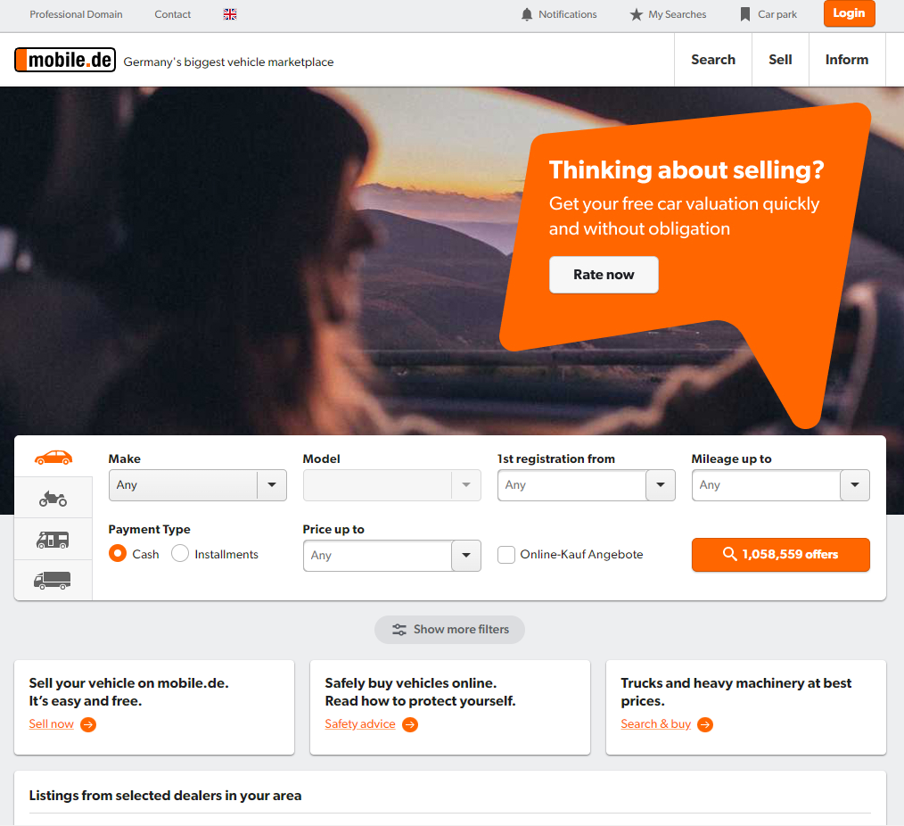

# Mobile.de web scraping scripts

## Purpose
The following contain Python scripts using BeautifulSoup and Selenium to scrape mobile.de.
The goal is to allow tracking of average price and number of active adverts for relevant models over time

Unfortunately only 50 pages of data can be scraped for each car make and model combination - since the relevant models are niche, this is not considered an issue.

### Code Usage
Overall, the code works as follows:
* **1st step:** only required once: Get all make and model combination and create a link based on them - the result is already stored under "car_data_base.csv"

* **2nd step:** Obtain the ad-links for selected make-model combinations. This step also already extracts price and the titles of the advertisement

* **3rd step (optional):** Extract detailed information such as horsepower, etc. from the advertisements. Note that this requires the opening of one link per advert and is time-intense

To make the gathered data more relevant to the user, the "car_data_base.csv" file should have a manually added "Relevant" column in which the user places "x" markers in rows (make-model combinations) that are relevant to him. E.g. if the prices of Porsche 911 are supposed to be gathered, the row with "Make" == "Porsche" and "model" == "911" should have an "x" in the column "Relevant". If that column does not yet exist, it should be created.

The code is based on the git repository by krinya (https://github.com/krinya/mobile_de_scraping) but heavily adapted for its current purposes, pythonized (instead of jupyter notebooks, with a main function, etc.) and updated since the original code was outdated
A requirements.txt file also exists

## Setup and running of code
### Setup
1. Install python and a package manager of your choice (PyCharm, Anaconda, Spyder, ...) - I personally use Anaconda
2. Create a virtual environment / Conda environment
3. Activate the environment where applicable (e.g. using conda activate environment)
4. Ensure pip is installed in the environment (e.g. conda install pip)
5. Install the required packages using pip install -r requirements.txt

### Running the code
The code has a main function which extracts all mobile offers, their prices, and titles and stores them.
It stores an aggregated file of all relevant makes and models under "data\make_model_ads_links\" and separate files for each make and model under "data\make_model_ads_links\YYYY-mm-dd"
It is worth noting that the aggregation is done over time, e.g. it contains both the data of Porsche 911 on 2022-01-01 and 2022-01-02 if both subfolders contain Porsche 911 specific data

### Folder and file structure

Key folders are:
* root directory: Containing the Python scripts, the results.csv file, as well as required git files
  * key files in the root directory are the results.csv file containing an overview of make, model, date, total offers online, as well as new and sold offers of each make and model at a given date
  * and the requirements.txt file detailing the required packages and their versions
* data directory: Contains detailed scraped data
  * make_models_ads_links contains for each make and model and date (time of the run) a summary of all posts that are online, as well as their and price, title
  * make_models_ads_data is currently empty, but can contain for each post that is crawled detailed information, such as e.g. horsepower, year of built, etc.
  * "make_model_ads_links_concatenated.csv" is a concatenation of all files in the make_models_ads_links folder - it therefore contains over all dates, makes, and models the information on link, title of posting, and price 
  * "make_and_model_links" file containing links to page 1 of each make and model combination. Also note that the "Relevant" column should be added manually, and filled with "x" for relevant models

